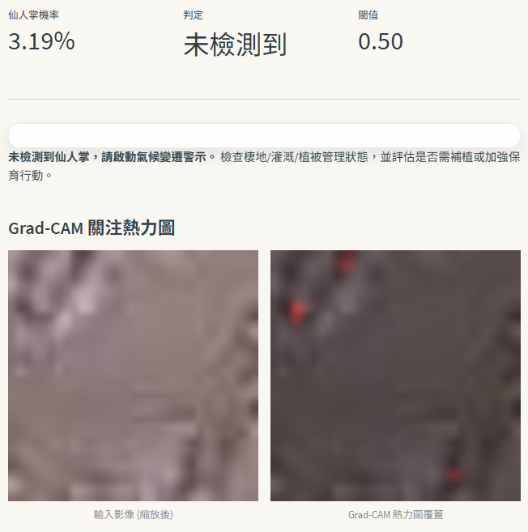

# 利用空拍影像進行氣候變遷預警 – 專案指南

## 專案介紹&DEMO影片網址
- https://youtu.be/nLvupqmwxMU
## 專案目標
- 透過空拍影像進行影像辨識，偵測仙人掌（乾旱指標植物），作為氣候變遷/暖化可能帶來環境變化的預警訊號。
- 提供可訓練與推論的程式（CNN、VGG16），以及具備 Grad-CAM 熱力圖的可視化介面，輔助解讀模型關注區域。
- 建置「氣候變遷防治BOT」，提供氣候防治相關對話與行動建議，並對離題問題進行拒答。

## 專案內容
- `cactus_training.py`：訓練/推論腳本，含簡易 CNN 與 VGG16 轉移學習。
- `streamlit_app.py`：上傳影像推論介面，顯示機率、判定、Grad-CAM 熱力圖與氣候變遷防治BOT（Gemini）。
- `requirements.txt`：相依套件。
- `.gitignore`：忽略資料集、模型等大型檔案。
- `GPT_chat.md`：對話紀錄摘要。

## 環境安裝
1) 建議 Python 3.10+（Gemini `google-genai` 需 3.10 以上，3.9 會退回舊版 SDK）。  
2) 安裝相依套件：
   ```
   pip install -r requirements.txt
   ```
3) GPU 選配：無 GPU 也可執行（自動以 CPU 推論）。

## 資料集
- 下載來源（Kaggle）：https://www.kaggle.com/competitions/aerial-cactus-identification/data
- 放置方式：將 `train.zip`、`test.zip` 置於專案根目錄，或解壓成平坦資料夾 `train/`、`test/`（同樣位於根目錄）。  
- 注意：資料集與大型檔案已列入 `.gitignore`，請勿提交；若曾提交，請自行清理版本史後再推送。

## 批次訓練/輸出
```
python cactus_training.py --batch-size 64 --image-size 96 --epochs-cnn 8 --epochs-vgg 6
```
輸出：`outputs/cnn.keras`、`outputs/vgg16.keras`、`outputs/submission.csv`。

## 互動式推論 (Streamlit)
```
streamlit run streamlit_app.py
```
- 側邊欄：選擇 `outputs/*.keras`/`outputs/*.h5` 模型或上傳模型、調整閾值、設定 Gemini API Key。
- 結果：上傳影像後自動推論，顯示仙人掌機率與判定、Grad-CAM 熱力圖覆蓋、暖化風險提示。
- 判讀：偵測到仙人掌 → 環境壓力暫不嚴重；未檢測到 → 觸發氣候變遷警示並建議檢查灌溉/植被。
- 介面風格：柔和粉彩、暖白背景的 eco-tech 儀表板，適合長時間閱讀。
- Gemini BOT：提供氣候變遷防治對話，離題問題將不予回答。
- LLM 建議：按「生成改善建議」生成改善建議並作為對話開場。

#### Streamlit 操作步驟
1) 在側邊欄選擇或上傳模型檔（`.keras`/`.h5`）。
2) 調整「判定門檻」，如需 Gemini 回覆可設定 `GEMINI_API_KEY`。
3) 在主畫面上傳影像，系統自動推論。
4) 查看機率、判定與 Grad-CAM 熱力圖。
5) 按「生成改善建議」或使用聊天框、推薦提問追問氣候防治問題。

#### 使用功能
- 模型選擇/上傳：支援切換不同模型權重。
- 判定門檻：控制「有仙人掌」判定的敏感度。
- Grad-CAM 熱力圖：預設啟用，顯示模型關注區域。
- 氣候風險提示：依偵測結果提供基本解讀。
- 氣候變遷防治BOT：Gemini 對話 + 推薦提問，離題拒答；無 API key 時改用預設文字。

### Streamlit 預測結果示意
- `UI_demo0.png`：Streamlit 預測畫面示意。
- `UI_demo1.png`：Streamlit 預測畫面示意。



## 模型指標（示意）
- CNN：驗證 Accuracy ≈ 0.94，混淆矩陣 [[830, 42], [45, 805]]
- VGG16（凍結卷積底座）：驗證 Accuracy ≈ 0.98，混淆矩陣 [[860, 15], [18, 842]]

## 注意事項
- 讀取順序：優先 `train/`、`test/`，否則回退 `train.zip`、`test.zip`。
- Early stopping 與 checkpoint 監控驗證 AUC。
- 若模型檔為 Git LFS 指標，需先 `git lfs pull` 取得實體權重。
